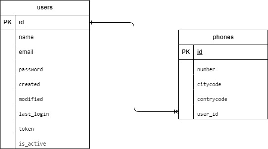
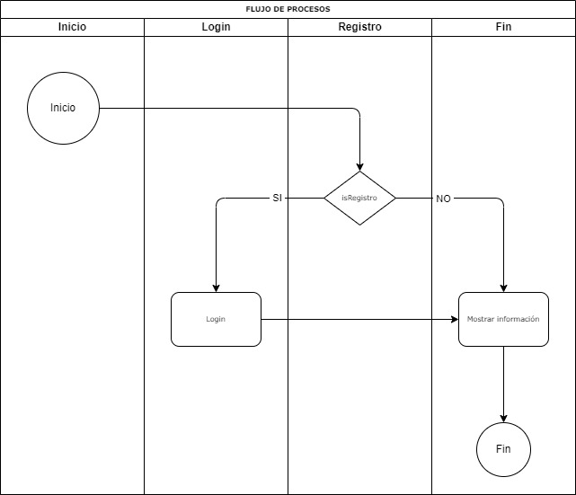

## ROOT (/api/users)

### Login (POST /login)
Inicio de session para obtener el token (JWT)

#### Request

```http
POST /api/users/login HTTP/1.1
Host: your-api-domain.com
Content-Type: application/json

{
  "email": "johndoe@example.com",
  "password": "examplePassword",
}
```

### Create a User (POST /register)
Crea el usuario que se envia.

#### Request

```http
POST /api/users/register HTTP/1.1
Host: your-api-domain.com
Content-Type: application/json

{
  "name": "XXXX XXXX",
  "email": "xxxxx@example.com",
  "password": "password",
  "phones": [
    {
      "number": "12345",
      "citycode": "01",
      "contrycode": "51"
    }
  ]
}
```

### Create a User (GET /get)

Retorna el usuario logeado

#### Request

```http
GET /api/users/get HTTP/1.1
Host: your-api-domain.com
Content-Type: application/json

```

# Diagrama entidad relación


# Diagrama de flujo
